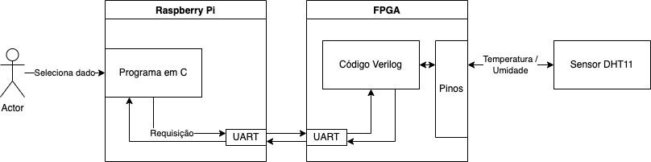
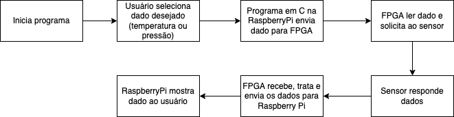

# Problema 02 - Interfaces de E/S

Projeto de Sensor Digital em FPGA utilizando Comunicação Serial.

O sistema utiliza a porta de comunicação serial (UART) de uma RaspberryPi para se comunicar com uma FPGA que é responsável por coletar dados de sensores conectados à própria.

O código responsável pela interação da Raspberry com a FPGA foi escrito em C.

O projeto da FPGA foi feito utilizando Verilog para descrever o circuito responsável pela leitura das requisições vindas da raspberry, solicitação dos dados aos sensores e resposta desses dados para a raspberry. Para carregar o circuito para a FPGA foi utilizado o Quartus v20.1.

## Recursos Utilizados
- Kit de desenvolvimento Mercúrio IV
- FPGA Cyclone IV
- Raspberry Pi Zero (ARMv6 BCM2835, SO RASPBIAN)
- Sensor DHT11
- Protoboard
- Fios

## Diagramas de arquitetura e fluxo
- arquitetura

- fluxo

## Transferência de arquivo no circuito

